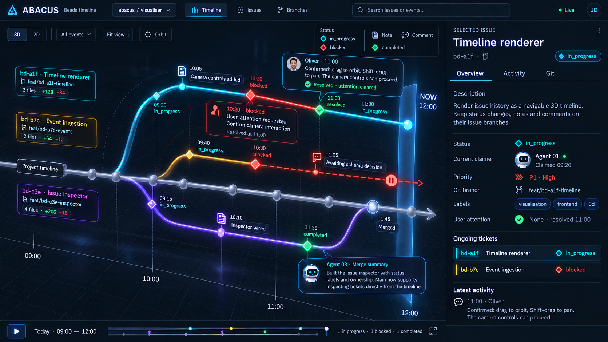

# Abacus Web Server Specification

> **Status: implementation in progress.** A limited interactive standalone preview exists;
> see [current capabilities](docs/dashboard.md). The full contract below remains
> required and is not yet implemented. This specifies a new interactive HTTP
> serving mode for Abacus. Existing commands retain their behavior. It deliberately
> extends the original no-web-UI/web-service scope in [PLAN.md](PLAN.md); all other
> shell-first, repository-ownership, and recovery constraints remain in force.
> [SPEC.md](SPEC.md) governs existing orchestration behavior.

## 1. Purpose and reference

Give operators a live, navigable **3D timeline** of Beads issues and their Git
branches, with issue editing, discussion, attention resolution, and optional
control of Abacus workers. Show work leaving a target branch, progressing through
states and conversations, and returning through verified Git integration.

The supplied concept image is copied unchanged into the repository. Use this
[reference image](docs/images/abacus-web-server-reference.png) when implementing
and visually reviewing the dashboard:



The image defines the visual direction and information hierarchy, not literal
sample data or proof that a feature already exists. In particular, real Abacus
branches normally use `abacus/<issue-id>`, not the image's `feat/...` convention.
“Completed” maps to Beads `closed`; attention resolution and Git integration are
separate facts, not additional Beads issue statuses.

**Confirmed scope:** interactive editing; configurable server binding, including
non-loopback interfaces; no authentication or authorization layer in this version.
The server exposes potentially sensitive source and powerful actions to everyone
who can reach it. It is intended for trusted networks only.

### Delivery boundaries

- Required: the reference's Timeline, Issues, Branches, inspector, 3D/2D controls,
  playback, live updates, notes/comments, status and attention editing, Git facts,
  efficient change-driven projections, and configurable HTTP binding.
- Required inferred additions: create/edit issues, dependency inspection/editing,
  deep links, accessibility, explicit history gaps, conflict handling, and source
  health. These make the pictured interface useful rather than a static mockup.
- Required: integrated `run --dashboard` with authoritative orchestrator state and
  controls, plus standalone `dashboard` for interactive Beads/Git access without
  starting agents. Both use the same interface and projection implementation.
- Deferred: authentication, roles, TLS termination, arbitrary multi-repo discovery,
  browser terminals, source editing, direct Git merging/resetting/pruning, hosted
  Git integrations, AI-generated summaries, and durable Abacus timeline storage.

## 2. Process mode and lifecycle

Provide two explicit entry points, **not a fifth agent harness mode**:

```sh
# Primary experience: agents plus the dashboard, in the same process.
abacus run --config <run-config> --dashboard \
  [--dashboard-bind <ip-or-host>] [--dashboard-port <port>] \
  [--dashboard-actor <display-name>] [--dashboard-poll-interval <duration>]

# Standalone interface: never starts or adopts agents.
abacus dashboard [--repo <main-checkout>] \
  [--bind <ip-or-host>] [--port <port>] [--actor <display-name>] \
  [--poll-interval <duration>]

abacus run --config abacus_codex.json --dashboard
abacus run --config abacus_codex.json --dashboard --dashboard-bind 0.0.0.0 --dashboard-port 8080
abacus dashboard --repo ./repo --bind 0.0.0.0 --port 8080 --actor onelson
abacus dashboard --repo ./repo --bind :: --port 8080
```

These are the required final commands/options; the current preview does not yet
implement all of them. Use `dashboard`
consistently: do not introduce `serve`, `--web`, or a dashboard-owned child `run`.
The command help must say: **“Host the interactive Beads/Git dashboard without
starting agents.”** `run --dashboard` means normal orchestration with the same
HTTP interface additionally enabled; `run` without it retains existing behavior.

### Common configuration and behavior

- Default to `127.0.0.1:8080`. Accept IPv4, IPv6, or a resolvable hostname;
  bracket IPv6 in printed URLs. Validate ports 1–65535 and a positive polling
  duration (default 5s, minimum 1s). Fail clearly on invalid or occupied bindings;
  never silently select another port or broaden the requested interface.
- Standalone options are scoped to `dashboard`; the `run` equivalents carry the
  `dashboard-` prefix. Explicit prefixed tuning flags require `--dashboard` to be
  enabled; they must not implicitly start a listener. Reject them on other commands.
- Add saved run fields `dashboard`, `dashboardBind`, `dashboardPort`,
  `dashboardActor`, and `dashboardPollInterval`, following existing inheritance,
  validation, CLI-override, and editor conventions. `dashboard` defaults to false;
  `--dashboard=false` disables a saved enabled setting without opening a listener.
  Saved tuning values may remain dormant when disabled. Preflight validates saved
  dashboard settings but never binds a socket or starts the HTTP host.
- `--repo` follows existing main-checkout selection and Beads identity rules,
  including config-relative repository paths for `run --config`. A request cannot
  select an arbitrary server-side repository, worktree, executable, or config path.
- Serve one repository and its registered worktrees. The header selector switches
  the viewed target branch/project context, not arbitrary repositories on disk.
- Print resolved URLs, repository, actor, source status, and an unmistakable
  **unauthenticated read/write access** warning, especially for wildcard/non-loopback
  bindings. Do not automatically open a browser. No authentication layer is added.
- Both entry points share the HTTP host, UI assets, Beads/Git collectors, caches,
  action validation, and projection code. Runtime-state/control capability is
  supplied only by the integrated orchestrator, not inferred from Beads or Git.

### Primary mode: `run --dashboard`

Host HTTP inside the existing orchestrator process, alongside its normal loops.
Run normal preflight and bind the requested listener before starting agent work,
claims, or harnesses; a binding failure must not leave a headless run working.
Do not create a second Abacus process or communicate with the current run through
stdio/HTTP loopback. Retain all controller leases, workspace ownership, claim
scheduling, and recovery rules; enabling a dashboard grants no extra authority.

Publish immutable runtime snapshots from existing state/event boundaries: worker
lifecycle, current assignments, process locations, claim gate and schedule reasons,
supervisor activity, pending actions, and recovery alerts. Route validated commands
to existing `ClaimGate`/`AgentControl` and supervisor control paths. HTTP handlers
must not directly alter agent loops, hold their locks while doing network I/O, or
wait on a browser. Use bounded client queues; slow/disconnected clients never stall
or cancel orchestration. Runtime-only updates do not rebuild Beads/Git projections.

Expose claims Pause/Resume; worker Stop/Restart and confirmed Clean Workspace;
configured supervisor Stop/Restart/Force run with prompt; and confirmed Stop run.
Use existing accepted-versus-completed semantics, schedule gates, supervisor
policy, and cleanup restrictions. No clean action is offered for supervisors/main
checkout. The timeline Play button is never a worker control. Opening the browser
never starts another run or changes claim permission.

`--dashboard` is additive: the normal terminal UI remains available, and both
interfaces reflect the same state and submit through the same control boundary.
Existing verbose/notification/intro rules remain unchanged. It may also accompany
`--stdio`; retain that protocol and stdout purity, with dashboard diagnostics on
stderr. `--start-paused` keeps its existing meaning and is additionally valid when
the dashboard provides the resume control even without a TUI/stdio. Without that
option, enabling the dashboard does not silently pause claims.

The HTTP host shares the run's lifetime. Finite runs exit normally when finished;
there is no implicit stay-alive server or browser Start-new-run action. Emit a final
lifecycle event best effort before closing streams; the loaded page retains its
last snapshot labelled disconnected. Use standalone `abacus dashboard` to browse
afterward. Stop run, stdio EOF/shutdown, and signals follow normal run cleanup,
then terminate the listener. Retain existing run exit codes, including schedule
exit 3 and Ctrl-C exit 130.

A failed browser connection/request is isolated. A fatal HTTP-host failure after
startup is reported through terminal/event diagnostics and disables web access
without interrupting healthy workers; do not automatically restart or rebind it.
Ordinary source outages show stale/degraded data and follow existing orchestration
failure policy independently. Process-wide fatal failures still use normal cleanup.

### Standalone mode: `abacus dashboard`

Startup validates Git, Beads, repository identity, and supported read/write CLI
capabilities. It does not initialize Beads, change its configuration, acquire the
orchestration controller lease, claim tickets, or start tmux/harnesses. Report
invalid target policy and disable affected actions without inventing it. No model,
run config, agent preflight, TUI, intro, or automatic audio is needed. Operational
logs go to stderr.

Keep the interface interactive for issue editing, comments, attention resolution,
and the other safe Beads operations below. Show **“Orchestrator not connected”**
and omit/disable runtime controls with an explanation. Another independent Abacus
run may leave observable Beads/Git facts, but this process cannot connect to,
control, or adopt it. Assignee is not evidence of a live worker; distinguish the
reported assignment from unknown process state and do not invent schedule/claim
permission. Switching from standalone to orchestration requires a separate explicit
`abacus run` invocation, not a browser button. No `--run-config` option is provided.

On SIGINT/SIGTERM, stop accepting mutations, finish or report in-flight operations
within a bounded deadline, close streams, and cancel read subprocesses. Never stop
external workers. Browser disconnects do not terminate the server. Exit 2 for
usage/configuration errors, 1 for fatal startup/runtime failures, 0 for a successful
requested stop, and 130 for Ctrl-C. Transient source outages leave it running with
visibly stale/degraded sections.

## 3. Interface and visual language

### Overall composition

Match the image's dark, technical instrument-panel aesthetic: nearly black navy
background, fine blue perspective grid, translucent bordered panels, restrained
cyan glow, crisp white headings, muted blue secondary text, rounded corners, and
thin line icons. Cyan, amber, and violet identify distinct issue lanes; red marks
blocked/attention conditions and green marks completion/resolution. Keep lane
identity color separate from status color. Avoid glow that obscures text.

At desktop widths, allocate roughly three quarters to the timeline and one quarter
to a resizable right inspector. A fixed top navigation bar contains the ABACUS
mark/name, “Beads timeline” subtitle, target context selector, **Timeline / Issues /
Branches**, search, connection indicator, and operator initials/settings. Initials
are a self-declared display identity, **not a signed-in account**. Use local
initials/identicons for authors and simple robot icons for evidenced agent authors;
no remote avatar service or invented portrait is necessary.

The timeline toolbar contains **3D / 2D**, **All events** filters, **Fit view**, and
**Orbit** camera mode. A compact legend explains status diamonds and note/comment
icons. Bottom transport contains Play/Pause, date/time range, multi-lane minimap,
range handles/playhead, status counts, and fullscreen. Keep the inspector and
transport readable above the scene, never perspective-distorted.

### True 3D timeline

Use a real perspective camera and WebGL scene, not a perspective-skewed screenshot.
Time increases along X, lanes occupy stable Y/Z offsets, and curves branch away
from a neutral silver target/project trunk. Depth separates overlapping issue
paths; it does not encode priority, completion percentage, or dependency rank.
Render luminous tubes/curves, spherical Git beads, diamond status markers, fine
vertical time guides, and a translucent blue **NOW** plane at current server time.

- Target commits are beads on the trunk; issue curves connect from their known
  execution start/branch evidence. Show unbound/no-branch issues in independent
  lanes with explicit labels, not fictitious Git forks.
- Open/in-progress work extends to NOW with its latest state. A blocked lane gets
  a red dashed continuation and pause glyph: waiting, not a future scheduled event.
- Closed issues receive a green completion marker. Curve reconnection to the
  target requires integration evidence; closed-but-unverified/unmerged lanes stay
  separate with a warning. Reopening adds another segment rather than erasing history.
- Status diamonds, document icons for notes, speech bubbles for comments, attention
  cards, and merge-summary cards use consistent hit targets and hover highlights.
- Lane-start cards show ID, title, branch, changed-file count, additions/deletions.
  Their Git comparison basis is available on hover and in the inspector.
- Callouts show author, timestamp, text preview, and resolution state. Click to
  inspect full text. Only selected/pinned/high-priority callouts expand; cluster
  dense events and hide low-priority labels before obscuring the scene.
- Stable lane assignment and object IDs preserve position across refreshes. Do not
  re-fit the camera or reshuffle all lanes when a comment arrives.

### Motion design: smooth, elegant, and purposeful

Motion should make the reference image feel alive without turning the dashboard
into a light show. Use restrained, coordinated transitions to explain selection,
new activity, and changes in spatial relationships. Preserve visual continuity:
elements move from their current rendered position rather than disappearing and
reappearing. Avoid bouncing, elastic overshoot, camera shake, flashing, confetti,
and perpetual spinning or pulsing. Reading and direct manipulation take priority.

Use shared motion tokens rather than unrelated timings for every component:

| Interaction | Target duration and treatment |
| --- | --- |
| Hover, focus, button feedback | 100–160 ms; subtle border/glow/opacity transition, with immediate input acknowledgement. |
| Tooltips, menus, tabs, status badges | 160–220 ms; gentle ease-out, short fade and at most a few pixels of translation. |
| Inspector/drawer and expanded callouts | 220–320 ms; coordinated slide/fade with stable text and surrounding layout. |
| New beads, lane changes, verified integration | 300–450 ms; smooth ease-in-out, bounded to affected scene objects. |
| Fit view, focus issue, 3D/2D switch | 350–600 ms; deliberate camera transition, immediately interruptible by user input. |

These are design targets, not delays before applying data or accepting actions.
Share easing curves across the DOM interface and 3D scene so linked elements settle
together. Prefer monotonic ease-out for entrances and ease-in-out for spatial
movement; exits may be slightly faster. A short, bounded stagger is acceptable for
small groups, but never animate a large backlog one item at a time.

**3D elements:**

- Orbit/pan/zoom respond immediately, with light frame-rate-independent damping
  rather than lag or prolonged drifting. Fit/focus interpolates camera position,
  target, and zoom along a predictable path without flying through labels/geometry.
  Never orbit automatically or move the camera in response to ordinary data refresh.
- New event beads fade/scale gently into their actual timestamp positions. Extend
  only a changed lane segment; do not redraw an entire branch as if all work just
  happened. Selection softly strengthens the lane/marker outline while related
  labels and the inspector update together.
- Status changes blend marker color/emphasis once, retaining shape and text cues.
  A newly raised attention request may receive one restrained highlight, then
  settle to a static alert. Repeated identical polls must never replay it.
- Animate a verified integration connector into place only when new evidence
  arrives. It is a presentation transition, not a depiction of an exact merge
  time or fabricated progress. Historical loading/reconnection does not replay
  old completions as new achievements.
- Filtering and event clustering use short fades and bounded positional transitions
  while preserving lane identity, selected objects, pinned cards, and time anchors.
  Switching 3D/2D smoothly aligns the view; crossfade if projection interpolation
  would distort the scene. Never spin the scene merely to demonstrate depth.

**Interface elements:** inspector panels and callouts open/close with subtle
slide/fade transitions; tab indicators glide between tabs; selected rows, filter
chips, and buttons receive consistent feedback. Reserve layout space for loading
content to avoid jumps. Keep list identity and scroll position stable during
updates, and never animate a row away while its editor is active. Update numerical
counts directly rather than rolling through fictitious intermediate values.
Pending mutations remain visibly pending until verified; animation completion must
not imply command completion. Do not steal focus or erase draft input during a
transition. Exiting overlays immediately stop intercepting input and leave the
keyboard/accessibility focus order correctly restored.

**Interruption, accessibility, and performance:**

- A new interaction cancels or retargets the current transition from its present
  visual state; do not queue obsolete animations. Direct dragging/scrubbing takes
  precedence over camera easing. Coalesce update bursts to their latest state.
- Honor `prefers-reduced-motion` by default and provide a persistent user override.
  Reduced-motion mode removes spatial travel, damping/inertia, scaling, stagger,
  and attention pulses; use immediate state changes or brief opacity-only fades.
  All information and controls remain available without animation or WebGL.
- Run animation frames only during active interaction, playback, or finite
  transitions, plus the existing low-frequency NOW update. Stop when settled and
  suspend in hidden tabs; on return, reconcile to current state instead of replaying
  missed decorative effects. No idle shimmer, moving dashes, or background particles.
- Prefer compositor-friendly DOM opacity/transforms and reuse scene geometry and
  buffers. Keep picking and labels aligned with animated positions. Animation must
  never query Beads/Git, rebuild unchanged data projections, or create server events.
  If rendering exceeds the frame budget, shorten/simplify effects before dropping
  interaction responsiveness, text legibility, or data correctness.

### Navigation and selection

Drag to orbit; Shift-drag or middle-drag to pan; wheel/pinch to zoom with safe
limits. Orbit/Pan mode selection makes the interaction discoverable. Fit view
frames the current filtered range; a selected-issue focus command frames one lane.
Click a lane, bead, card, list row, or minimap event to share selection with the
inspector. Hover shows a lightweight tooltip; Escape clears temporary overlays.
Pinned callouts persist until dismissed, not until the next source refresh.

2D is an orthographic, non-perspective timeline of **the same data and selection**.
Keep keyboard-accessible DOM lists/controls alongside the canvas. Offer keyboard
camera controls and focus traversal, visible focus rings, text labels for every
color-coded state, sufficient contrast, reduced-motion/no-glow settings, and a
functional 2D/list fallback when WebGL is unavailable or loses context. On narrow
screens the inspector becomes a drawer; no feature should require precise 3D picking.

### Time, playback, and filters

Default to today's local calendar range through NOW, with an empty-state option to
expand the range. Display timezone and date, with UTC timestamps in data/tooltips.
Time positions respect elapsed time; Git topology remains authoritative if commit
clocks are skewed, and skew is labelled rather than silently reordered as fact.

Live mode follows NOW until the user pans/scrubs away. Historical playback moves
a playhead through known events, offers speed selection, and never mutates data.
Continue collecting live updates while replaying but do not jump the viewport;
show “new events” and **Return to live**. Counts use the active filters and playhead
state, with an explicit label. Historical inspectors say “as of”; editing requires
returning to and rereading the current issue. Unknown historical fields remain
unknown rather than being backfilled from today's state.

Filter by time range, event kind, status, attention, issue, assignee, label, type,
priority, and target. Search IDs/titles, branch names, and loaded note/comment text;
mark the indexed time range and load-more boundary instead of implying complete
search over unloaded history. Filters are view-only and never change dispatch
filters. Store view/camera preferences locally and encode shareable target, range,
issue, event, and view mode in the URL. Never put draft comments in URLs.

### Selected issue inspector

Follow the reference's **Overview / Activity / Git** tabs:

- Header: title, copyable issue ID, actual current status, action menu.
- Overview: description, status, assignee, verified current worker/claim time if
  known, priority (`P1 · High` in the example), branch/target, labels, attention
  state and last resolution, dependencies/children, and related ongoing tickets.
- Activity: chronological state transitions, notes, comments, attention requests
  and responses, outcome/merge summaries. Expand full bodies; link each row back
  to its timeline marker. Preserve separate request/resolution events.
- Git: binding/start commit, target and issue tips, commits, worktree location and
  dirty/unknown state, triple-dot file summary/diff, integration evidence, and
  branch-deleted/diverged/missing-history warnings.
- Ongoing tickets: scoped in-progress and blocked issues with ID/title/status;
  clicking switches selection. Latest activity shows actual authors and content.

Issues provides a sortable, paginated accessible table with the same filters,
selection, and editing actions. Branches provides target/issue branches, worktrees,
ahead/behind counts, binding/integration state, and links to timeline/diffs. Show
unassociated branches without guessing an issue from arbitrary substrings. Neither
screen is merely decorative navigation.

## 4. Interactive operations

Use typed, allowlisted commands through existing/new thin `Beads` helpers. Never
expose raw shell commands, SQL, arbitrary metadata editing, or filesystem browsing.

| Action | Required behavior |
| --- | --- |
| Create issue | Validate title, description, type, priority, labels, and target; use `bd create`. Respect target/reasoning policy. With live dispatch, use the existing safe non-ready draft/publish workflow rather than exposing a half-configured ready task. |
| Edit issue | Update title, description, priority, labels, and append notes; preserve unrelated fields and reserved Abacus metadata. |
| Add comment | Append exact user text with `bd comment`; display verified stored author/time. No AI rewrite or automatic summarization. |
| Change status | Offer valid supported states; label `closed` as Completed. Warn that changing an assigned or reserved issue can disrupt an agent, but allow the requested change; do not silently stop workers or release reservations. Completion never performs or proves a Git merge. |
| Change assignment | Permit inactive issue assignment/unassignment with conflict checks; use atomic `--claim` for claiming, never simulate agent ownership with a display label. |
| Request attention | Append explanation, then add `abacus:needs-user-attention`; no implicit blocked transition. An explicit “Request attention & block” additionally sets blocked after the explanation is verified, warning about possible lifecycle ownership conflicts. |
| Resolve attention | Reuse `ResolveUserAttentionAsync`: optional response first, label removal second; comment failure prevents resolution. “Resolve and reopen” explicitly sets open and clears assignee, separate from plain Resolve. |
| Set reasoning level | Replace only `abacus:{high,medium,low}_reasoning` via label deltas; preserve unrelated labels and reject clearing under strict reasoning policy. |
| Change target | Reuse target setter/checker semantics; no active retargeting, bound-destination changes, or browser-authored execution bindings. |
| Edit dependencies | Typed add/remove dependency actions through `bd dep`; reject unsupported/cyclic relationships, recheck readiness, and preserve existing edges on failure. |

Set `BEADS_ACTOR` to `--actor` (standalone) or `--dashboard-actor` (integrated),
defaulting to the repository's effective Git `user.name` (or `user.email` if no
name is set), for dashboard mutations. Preserve worker actors. It is audit
attribution only, shared by this server's clients, not an identity guarantee.
Show the configured actor next to every composer/confirmation.

Every mutation carries a request ID and issue revision from the displayed
snapshot. Serialize server-local writes per issue (repository-wide for related
issue/target operations), reread before writing, reject stale revisions with 409,
and verify after writing. Disable duplicate submission while pending. Cache
request results for bounded same-process retries; reuse of an ID with a different
payload is an error. Distinguish completed, rejected, partially applied, and
outcome-unknown. Never blindly retry an append after timeout/disconnect/restart.

**This is not cross-process compare-and-swap.** Existing `bd` metadata updates
cannot make read/check/write atomic against external agents. Use native atomic
operations where available. Warn before status and combined attention/status
changes when an issue has active or uncertain execution; these changes do not
stop workers or reconcile reservations. Require the owning run to be stopped/parked
and its reservation explicitly reconciled before changing ownership or target.
A stopped worker may still reserve its ticket. In standalone
mode, require operators to stop competing writers for ownership or target repairs;
if quiescence cannot be established, refuse those repairs. Ordinary comments
and warned status changes remain available.

Do not treat multi-command edits as transactions. If a response comment succeeds
but label removal fails, report exactly that, refresh, and retry only the missing
step after review. Do not overwrite a racing terminal status or assignee in the
name of rollback. Reject mutations during stale/unreadable source state. Viewing
never runs `bd dolt pull/push`, Git fetch/push, or repair; standalone writes retain
existing standalone synchronization semantics (no automatic push). Make pending
remote synchronization explicit. Integrated orchestration retains its normal sync
rules; dashboard-only writes do not implicitly trigger synchronization.

## 5. Authoritative data and history

### Source boundaries and existing code

| Source boundary | Reuse/extension |
| --- | --- |
| `Program.cs`, `Options.cs`, `CliHelp.cs` | Standalone `dashboard` dispatch and scoped `run --dashboard` options; do not overload `AgentMode`. |
| `CommandRunner.cs` | `ProcessStartInfo.ArgumentList`, cancellation/timeouts and child-scoped environment; extend with bounded/streamed output for large reads. |
| `Beads.cs`, `Beads.Targets.cs` | Existing issue/attention/comment reads and mutations; add web-specific detail/history DTOs rather than inflate dispatch models. |
| `Git.cs`, `Git.Targets.cs` | CLI worktree/ref/status/binding validation; add bounded history and comparison helpers. |
| `ProjectInfo.cs`, `Targets.cs`, `TicketTargets.cs` | Repository facts, configured targets, execution binding validation. |
| `AbacusApplication.cs`, `Output.cs`, `EventReporter.cs`, `ClaimGate.cs`, `AgentControl.cs` | Integrated runtime snapshots and shared controls; reuse the semantics exposed by `StdioControl.cs`, not a child-process protocol. |
| `RunConfiguration.cs`, `RunConfigurationEditor.cs` | Saved dashboard enablement/tuning, inheritance, CLI precedence, and editor fields. |
| `WorktreePool.cs`, `PoolAssignment.cs`, `AgentRunRegistry.cs` | Preserve controller leases, reservation/uncertainty and fenced assignment identity; no web-side recovery bypass. |

Beads owns issue content/status/labels/dependencies/comments and execution metadata.
Git owns actual refs, commits, topology, worktrees, dirty state, and diffs. In
integrated mode the current orchestrator owns transient process state; standalone
mode has no authoritative runtime-state source. Never substitute one for another.

Use `bd --readonly export` for the baseline JSONL issue/comment/dependency snapshot,
as the existing latest-comments reader does; exclude infrastructure/memory records.
Use `bd show <ids...> --include-comments --json` for selected detail, target-aware
existing readers for bindings, and capability-tested `bd history <id> --json` for
available version history. Installed CLI help/schema fixtures take precedence over
assuming newer upstream flags are available. Upstream command references are
[Beads CLI documentation](https://github.com/gastownhall/beads/blob/main/docs/CLI_REFERENCE.md)
and [issue history](https://github.com/gastownhall/beads/blob/main/docs/cli-reference/history.md).

A current issue export is **not an event log**. History may be missing, compacted,
or coalesced into Dolt commits, and working-set edits need not create commits.
Use stable source event/comment IDs where provided; otherwise derive deterministic
IDs from source, issue, revision, field transition and ordinal. Deduplicate poll
observations. Each event records source, source revision, event timestamp (nullable),
observed timestamp, and certainty: recorded / observed / inferred.

Do not manufacture old claim times, note timestamps, actors, attention resolution
reasons, or status transitions from current fields. A change first observed by this
server is labelled “observed at,” not asserted to have happened then. If a status
changes twice between polls, do not claim both transitions unless history supplies
them. Show coverage bounds/gaps and retain unknown states in playback. Initial
history loads are bounded and lazy. Run-local observations disappear on restart;
rehydrate only supported Beads/Git history. Persistent history storage is deferred.

### Git correlation and integration

Prefer validated `metadata.abacus_execution` for issue branch, target ref, and
starting commit; resolve unbound targets through existing target policy. A matching
`abacus/<id>` is a labelled convention-based association, not proof of a valid
execution binding. Missing/pruned branches retain Beads history and explicit unknown
Git fields. Unborn targets and unrelated histories get honest empty/error states.

Read refs/worktrees with `git for-each-ref` and `git worktree list --porcelain`;
read graph and bounded commits with `git log`; verify ancestry with
`git merge-base --is-ancestor`. Resolve browser-selected refs to validated full
object IDs before comparison. Use target as base, defaulting to `main` only under
the existing valid target policy. **Compare with `<target>...<issue-branch>`**, not
two-dot, and key the cache by both full tip IDs and comparison options. This is
merge-base-to-issue-tip change information, not “remaining work after merge.”
See [Git's diff documentation](https://git-scm.com/docs/git-diff).

Use NUL-delimited filename output, `--numstat`/name-status for summaries, and lazy
bounded patches with external diff/text conversion disabled. Binary files show
“binary,” not invented line counts. Keep uncommitted worktree changes separate
from committed branch statistics; do not download LFS assets or inspect ignored
caches. Branch comparison caches must invalidate on target movement too.

An issue tip reachable from the target proves **contained in target now**, not an
exact merge timestamp or that the current issue was completed correctly. Draw an
integration connector when evidence exists, labelling its time as observed if no
historical landing event is known. Fast-forward integration may have no merge
commit. Squash/cherry-pick is not proven by ancestry; report unverified unless a
separate trustworthy record exists. A “Merge summary” displays a sourced outcome
comment/commit message, never an invented AI summary. A later force-push can revoke
current containment; preserve the old observation as historical evidence.

## 6. Change detection and efficient projection

**Hard requirement:** after initial load, build/serialize display projections only
when their dependencies change, or on the first request for an uncached range or
detail. Camera movement, clock ticks, SSE heartbeats, extra browsers, and identical
poll results must not rerun Git history/diffs or rebuild issue/event graphs.
Cheap correctness probes are permitted; “change-driven” cannot mean zero CLI
reads in the absence of a reliable external notification/change-token contract.

### One shared collector, not one poller per browser

1. Build one initial canonical issue snapshot and lightweight Git ref/worktree
   snapshot. Do not eagerly retrieve every issue's history and full patch.
2. Run a repository-wide async collector at the configured dashboard poll interval,
   sharing its results across clients. Filesystem notifications and successful
   local writes schedule an earlier check; debounce bursts for about 250 ms. Never run overlapping
   refreshes of the same source; retain dirty-again signals during a refresh.
3. Compare canonical **content**, excluding collection timestamps, incidental JSON
   ordering and volatile diagnostics. Generate stable issue/ref/event fingerprints.
4. Recompute affected indexes, joins, status counts and DTOs only for changed IDs;
   publish a new immutable view revision atomically. Identical content publishes
   nothing. Bound work per refresh; coalesce rapid superseded updates.
5. Requests use the shared cache. Coalesce concurrent cache misses and cache lazy
   details by source revision. Bound cache memory, history windows, diff size,
   concurrent subprocesses, request bodies, and per-client queues. Evict least
   recently used details without evicting the baseline needed for correctness.

In integrated mode, share collected facts with existing orchestrator monitoring
where contracts match (attention, comments, worktree metadata); do not add a second
identical dashboard polling loop. Safety-critical fresh claim/ownership reads must
remain fresh and must never be replaced by a potentially stale display cache.
Runtime state changes arrive directly from the orchestrator and update only their
own projections. Standalone mode runs the same collectors without a runtime source.

### Beads: do not confuse HEAD with a change token

`ReadCurrentDoltCommitAsync` currently extracts only the commit from
`bd --readonly vc status --json`. **That is insufficient:** Beads 1.2.2 supports
uncommitted/batched working-set writes, and a dirty boolean or changed-table list
can remain identical across multiple edits. A local `.beads` watcher also misses
writes to a shared remote Dolt server.

Baseline compatible strategy: once per polling interval, stream a read-only
issue export, canonicalize/fingerprint issue records (including comments, labels,
notes, dependencies, and deletions), and compare to the previous snapshot. Parsing
and hashing source data are the detection cost; do not then rebuild unchanged
presentation data. Request histories only for changed issues in demanded ranges;
recheck demanded history on a changed Dolt history revision even if current issue
fields are identical, since compaction/history changes affect coverage.

An optimization may use a cheaper **documented, capability-tested revision that
covers all relevant committed AND working-set tables**, but no such universal
token is assumed here. A list of issue `updated_at` values is insufficient unless
comment/dependency/deletion coverage is proven. Retain periodic export reconciliation
even with notifications/tokens. Never query Dolt directly, inspect database files,
require hooks, or force a commit to make change detection convenient. If full
exports cannot meet budgets at large scale, expose lag and reduce polling frequency
explicitly; do not silently trade correctness for HEAD-only detection.

### Git invalidation

Probe refs and registered worktrees through Git each interval. Watch the resolved
common Git directory plus relevant per-worktree administrative paths as hints;
cover packed refs, HEAD, index, and worktree registration. Never assume `.git` is
a directory. Notifications can overflow/miss events; periodic CLI reconciliation
is mandatory. Include target-policy file changes in association invalidation.

Changed ref tips invalidate only dependent graphs/ancestry/diffs. Probe dirty state
with existing read-only porcelain status semantics (`--no-optional-locks`). Full
uncommitted diffs are demand-loaded for visible worktrees. A dirty boolean/porcelain
path list is not a content revision: a second edit to an already-dirty file must
invalidate the visible diff via content fingerprint/reconciliation. Ignore caches,
`node_modules`, build outputs, and the server's own diagnostics for scene rebuilds.

### Publication, consistency, and failures

Beads and Git cannot be read in a single atomic transaction. Tag responses with
both source revisions and collection times. Revalidate refs around expensive
reads; retry a bounded number of times when they move, then show “updating” rather
than publish a falsely coherent association. Never erase last-good data on errors.
Mark affected sections stale with last success/error and disable their writes.
Retry failures with bounded backoff, preserve the other source's functioning view,
and do not send repeated unchanged errors as new activity events.

Use HTTP ETags and Server-Sent Events (SSE) for revisioned upserts/removals and
source health. One monotonic stream sequence plus server-instance ID permits
ordered application; keep a bounded replay buffer. Honor `Last-Event-ID`; gaps or
server restart require one fresh snapshot. Snapshot responses include the stream
cursor so a mutation between snapshot and subscription cannot be lost. Slow clients
resync rather than accumulating unlimited queues. Heartbeats contain no issue data.

Render on demand in the browser. Animate only camera interaction, replay, finite
transitions from the motion-design section, and a low-frequency NOW/playhead update
while visible; pause animation in hidden tabs.
Reuse buffers/layout for unchanged objects, cull offscreen markers, aggregate at
wide zoom, and preserve selection. Moving NOW does not increment data revision.

## 7. HTTP boundary, assets, and safety

Serve bundled HTML/CSS/JavaScript/fonts/icons locally from the Abacus distribution;
no CDN/runtime Node server or network fetch is required. Prefer a small WebGL
renderer with a narrowly scoped bundled library if needed; document its version
and license. Keep HTTP hosting in the existing .NET executable, using a supported
platform HTTP host rather than hand-writing HTTP/TCP parsing. Any framework/build
exception to PLAN.md's dependency constraints must be explicit at implementation
review. No Beads/Git/Dolt SDK, service database, message bus, or vendor API is added.
The optional harness path remains CLI-based, consistent with
[upstream OpenCode documentation](https://github.com/anomalyco/opencode/tree/dev/packages/web/src/content/docs).

Proposed versioned routes:

| Route | Purpose |
| --- | --- |
| `GET /api/v1/project` | Identity, capabilities, target choices, actor, source health, hosting mode and integrated runtime-control availability. |
| `GET /api/v1/snapshot` | Filtered/ranged issue-lane/event summary, revisions, coverage, cursor and counts. |
| `GET /api/v1/issues/{id}` | Current details and resource revision. |
| `GET /api/v1/issues/activity` | Whole-project recorded history in one revision-fenced read, per-issue revisions and coverage. |
| `GET /api/v1/issues/{id}/activity` | Bounded history with coverage and continuation cursor. |
| `GET /api/v1/branches` | Refs/worktrees/associations and summary comparison data. |
| `GET /api/v1/issues/{id}/diff` | Validated lazy comparison, bounded patch/files, source tip IDs. |
| `GET /api/v1/events` | Shared revisioned SSE stream; clients apply active view filters. |
| `POST /api/v1/issues` | Validated issue creation with request ID. |
| `POST /api/v1/issues/{id}/actions` | Typed edit/comment/status/attention/target/dependency action with expected revision. |
| `POST /api/v1/run/actions` | Allowlisted in-process run controls and confirmations; unavailable in standalone mode. |

Specify JSON schemas and limits in implementation tests. Reject unknown mutation
fields, unsupported actions, oversized bodies (413), stale revisions (409), invalid
inputs (400), unavailable capabilities/sources (503), and absent resources (404).
Async controls return 202 with operation ID and subsequent result/state events;
acceptance is not completion. Filter/range cache keys must include source revision.

No login, tokens, roles, or authentication middleware. **Nonetheless:**

- Restrict Host headers to configured deployment names/interfaces; check browser
  Origin on mutations, reject cross-origin requests, and do not enable permissive
  CORS. This is basic cross-site/DNS-rebinding protection, not authentication.
- Require JSON and an explicit same-origin mutation header; never mutate on GET.
  An intentionally connected network client can still perform every allowed action.
- Render issue/comment/commit text as escaped text or sanitized Markdown, with a
  restrictive content-security policy. Disable raw HTML and unsafe link schemes;
  no issue text may become executable HTML, JavaScript, shell, or CLI options.
- Pass typed validated arguments through `ArgumentList`, using safe option/value
  boundaries and full refs/object IDs; reject leading-option identifiers. Escape
  hostile filenames in UI; do not expose file-serving traversal/symlink escape.
- Avoid exposing environment variables, secrets, raw configs, command prompts,
  memory exports, credential-bearing remote URLs, and unrestricted subprocess logs.
- HTTP has no transport confidentiality. Operators must use firewall/VPN or an
  independently managed secure proxy if needed; the server does not configure one.

## 8. Acceptance criteria and verification

This document and image do not implement or enable serving. Implementation is
complete only when automated tests and manual visual checks demonstrate:

1. `dashboard --help` is standalone; both entry points support custom IPv4/IPv6
   binding; scoped options, saved config/CLI precedence and disabled enablement
   are tested. Invalid options/occupied ports fail before worker startup. Standalone
   editing needs no model and never starts agents or acquires controller ownership.
2. A fixture matching the image shows three separated lanes: one blocked then
   resolved/in-progress with response card; one still blocked with dashed tail;
   one closed with sourced integration connector and merge summary. Inspector,
   minimap, timestamp labels, counts and event legend agree with the same data.
3. Orbit, pan, zoom, fit, 2D toggle, selection, filters, search, deep links, fullscreen,
   playback and Return to live work without source mutations or subprocess calls.
   Keyboard/list fallback and narrow-layout inspector expose the same content.
4. Notes/comments/status/attention/create/dependency edits persist through actual
   CLI contracts. Tests cover literal hostile text, comment-success/update-failure,
   request retries, stale revisions, unavailable sources, and ownership conflicts.
5. External Beads edits appear within one configured poll interval plus bounded
   query/debounce time, including two consecutive edits with unchanged Dolt HEAD,
   comment-only/dependency-only changes, deletions, and shared-server writes with
   no local filesystem event. Detection never forces commits or modifies config.
6. After warmup, a 60-second unchanged-source test with ten clients produces
   **zero projection rebuilds, zero repeat history/diff queries, and zero data SSE
   messages** when runtime state is also unchanged; only the single shared probe
   schedule and heartbeats continue. Changed runtime state updates its own view
   without repeating unchanged Beads/Git collection or projection work.
   Record export bytes/hash cost separately rather than hiding detection overhead.
7. A changed issue invalidates only its dependent projection; target-tip movement
   invalidates related triple-dot comparisons; new worktrees, packed-ref changes,
   branch deletion, force-push, and repeated edits to an already-dirty file appear.
8. Cold/uncached history and patches load once per cache key under concurrent
   requests. Cancellation, output bounds, cache eviction, watcher overflow, missed
   events, SSE gaps/restart, slow clients, and malformed CLI output are covered.
9. Missing history, identical timestamps, clock skew, no branch, closed-unmerged,
   fast-forward, squash, deleted branches, and reopened issues never invent events
   or claim exact merge/claim times without evidence. All displayed data has provenance.
10. Integrated tests prove direct authoritative state/control access, normal
    preflight/lease safety, unchanged claim defaults, `--start-paused`, schedule-aware
    resume, accepted/completed controls, clean confirmation, supervisor restrictions,
    TUI/stdio coexistence, finite exits, and graceful shutdown. No child Abacus run
    is spawned. Slow browsers/HTTP-host failure do not stall healthy workers.
    Standalone mode reports no connected orchestrator and never steals leases or
    advertises control of an unrelated controller. Both use shared UI/projection code.
11. Malicious text, path traversal, option injection, cross-origin mutations, hostile
    Host headers, oversized requests, and raw secret-bearing diagnostics are rejected
    or safely rendered. Trusted remote clients can still edit without authentication.
12. Benchmark a documented fixture of 1,000 issues/10,000 events and ten clients.
    Target <=2s warm initial viewport and smooth 30+ FPS camera navigation on a
    recorded reference machine, with event clustering/culling; idle browser scene
    rendering stops. Record cold CLI costs, latency, peak memory, subprocess count,
    and detection mode. Do not promise unlimited history or dataset size.
13. Motion review covers camera focus/fit, 3D/2D switching, new events, status and
    integration changes, inspector/callout transitions, and rapid interruption.
    Test reduced-motion preferences/override, keyboard focus, active drafts,
    burst updates, and hidden-tab resume. Identical polls/reconnects do not replay
    effects; settled scenes stop rendering; animation never changes source facts
    or delays input. Verify the timing/easing guidance on the benchmark fixture.

Use existing fake-CLI tests plus disposable real Git fixtures and browser tests.
Pin supported Beads JSON fixtures/capabilities (the inspected local CLI is 1.2.2);
verify working-set/history behavior before selecting any optimized change detector.
This repository has no active Beads workspace at specification time, so no live
project history or mutation behavior was validated here. No Unity build is involved.

Implementation should proceed in small increments: prove change detection and
history limits first; add cached read-only HTTP and accessible 2D lists; deliver
interactive edits and the reference-quality 3D scene; integrate in-process run
state/controls and expose the same dashboard standalone. Both entry points and
their distinct capabilities are required for completion. The intermediate read-only
slice is not the final interactive deliverable.
